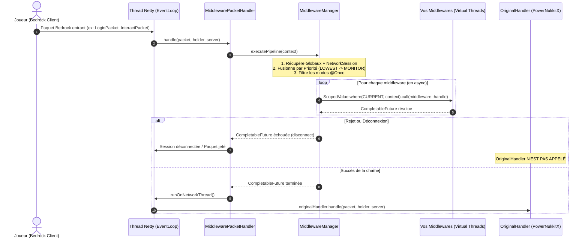
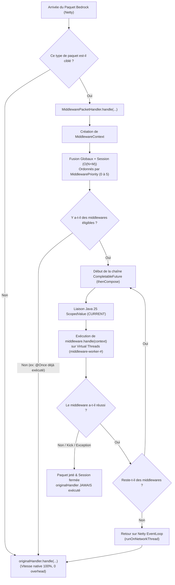

# Architecture & Cycle d'Exécution des Middlewares (Java 25 LTS)

Ce document décrit en détail le cycle de vie, le mécanisme d'interception et l'ordonnancement asynchrone des middlewares au sein de **MiddlewarePlugin**.

---

## 📊 Diagramme de Séquence

---

## 🔄 Flux de Décision (Flowchart)

---

## 🔍 Les 5 Phases d'Exécution

### 1. Interception Non-bloquante (`MiddlewarePacketHandler`)
- PowerNukkitX transmet le paquet à `MiddlewarePacketHandler` (qui remplace l'original dans `PacketHandlerRegistry.MAP`).
- Si aucun middleware global ou par session n'est actif pour ce paquet, la requête est immédiatement déléguée à l'`originalHandler`.

### 2. Fusion et Tri par Priorités (`MiddlewareManager`)
- Les middlewares globaux et ceux de la `NetworkSession` du joueur sont fusionnés en $O(N + M)$.
- Respect strict des 6 priorités :
  $$\text{LOWEST (0)} \longrightarrow \text{LOW (1)} \longrightarrow \text{NORMAL (2)} \longrightarrow \text{HIGH (3)} \longrightarrow \text{HIGHEST (4)} \longrightarrow \text{MONITOR (5)}$$
- Les filtres `SessionState`, `NetworkHandler` et le mode `@Once` sont appliqués via des switch expressions modernes.

### 3. Chaînage Asynchrone & Contexte Java 25
- Les middlewares sont enchaînés avec `chain.thenCompose(...)`.
- `ScopedValue.where(MiddlewareContext.CURRENT, context)` injecte le contexte de manière immuable et sans fuite mémoire, permettant d'appeler `MiddlewareContext.current()` à tout moment.

### 4. Exécution I/O sur Threads Virtuels Nommés
- Les opérations longues (SQL, Redis, API REST) sont déléguées à `virtualExecutor` (`middleware-worker-#`).
- Le serveur ne subit **aucun lag de tick** ni ralentissement réseau.

### 5. Décision Finale
- **En cas de rejet / déconnexion** : le paquet est jeté, le handler original de PowerNukkitX n'est **jamais appelé**.
- **En cas de succès** : nous rebasculons sur l'EventLoop Netty (`runOnNetworkThread`) et appelons `originalHandler.handle(...)`.

---

> [!NOTE]
> Ce projet s'inspire directement du plugin de référence [AID-LEARNING/MiddlewarePlugin](https://github.com/AID-LEARNING/MiddlewarePlugin) créé par **SenseiTarzan**. Il a été converti, restructuré et enrichi pour Java 25 LTS & PowerNukkitX avec l'assistance d'outils d'intelligence artificielle avancés.

